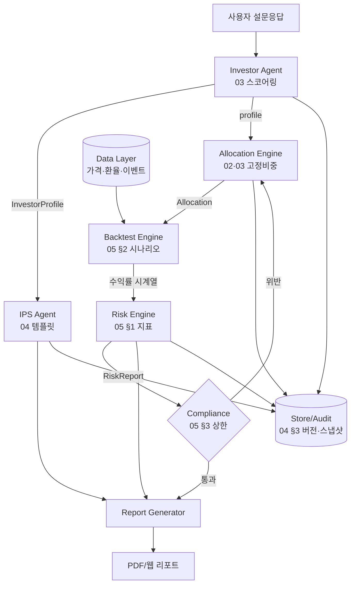

# 06. 시스템 아키텍처 초안 (MVP)

상위 기획안 4장(시스템 구조)을 **컴포넌트·데이터 흐름·서비스 계약**으로 구체화한다.
목표: 03~05 문서에 흩어진 스키마를 하나의 파이프라인으로 연결하고, 각 컴포넌트의 입출력을 계약으로 고정해 병렬 착수를 가능하게 한다.

## 0. 설계 원칙 (MVP)

1. **에이전트 = 교체 가능한 서비스**. MVP는 룰 기반 구현, 이후 LLM/최적화로 뼈대 유지한 채 교체 (INDEX 원칙 3).
2. **계약 우선(contract-first)**. 컴포넌트 간 경계는 JSON 스키마로 고정 (03/04/05에 이미 정의된 스키마 재사용).
3. **단방향 파이프라인 + 컴플라이언스 게이트**. 각 단계 산출물은 다음 단계 입력이며, Compliance는 배정 직전 차단·강등 권한을 가진다.
4. **계산은 현지통화, 표시에서 통화 토글** (D4). 리스크는 두 통화 값을 모두 저장 (05 §0).
5. **재현성**. 동일 입력·동일 코드버전 → 동일 결과. 모든 산출물에 입력 스냅샷·모델버전 기록 (05 §0, 04 §3).

## 1. 컴포넌트 개요

| 컴포넌트 | 역할 | MVP 구현 | 입력 → 출력 | 규격 |
| -- | -- | -- | -- | -- |
| **Survey/Investor Agent** | 설문 → 위험점수 → 성향 | 룰 기반 스코어링 | 설문응답 → `InvestorProfile` | 03 |
| **IPS Agent** | 성향 → 투자정책서 | 템플릿 렌더링 | `InvestorProfile` → `IPSDocument` | 04 |
| **Allocation Engine** | 성향 → 모델포트폴리오 배분 | 고정비중 4종 | `profile` → `Allocation`(티커·비중) | 02 §3, 03 §3 |
| **Data Layer** | 시세·환율·이벤트 수집/정제 | yfinance/FRED/Stooq | 티커 → 조정가격 시계열 | 02 §5, D7 |
| **Backtest Engine** | 15년+ 백테스트·시나리오 | 벡터화 시뮬레이션 | `Allocation`+가격 → `BacktestResult` | 01 §5, 05 §2 |
| **Risk Engine** | 리스크 지표·민감도·집중도 | 05 계산식 | 수익률시계열 → `RiskReport` | 05 §1,4 |
| **Compliance Guardrail** | 성향별 상한·강등·차단 | 하드룰 | `RiskReport`+`profile` → `breaches`/강등 | 03 §4, 05 §3 |
| **Report Generator** | 설명 리포트(자연어) | 룰 기반 문장→후에 LLM | 전 단계 산출물 → 리포트(PDF/웹) | 01 §4, 04 §2 |
| **Store/Audit** | 버전·감사 로그 | 관계형 DB | 모든 산출물 → 영속화 | 04 §3 |

## 2. 데이터 흐름



**컴플라이언스 재계산 루프**: Compliance가 성향별 상한(05 §3) 또는 Q6(손실감내) 초과를 감지하면 → 한 등급 강등 → Allocation 재배분 → Backtest·Risk 재실행. 최대 강등 횟수를 넘으면 최보수(안정형)로 확정하고 사유를 `breaches`에 기록 (03 §4).

## 3. 서비스 계약 (Interface Contracts)

각 경계의 계약은 기존 문서 스키마를 정본으로 삼는다. 신규/보강분만 아래 명시.

### 3.1 Survey → Investor Agent (입력)
```json
{
  "answers": {
    "Q1_age": 41, "Q2_horizon": 4, "Q3_objective": "증식", "Q4_capital": 50000000,
    "Q5_monthly": 800000, "Q6_max_loss": -0.20, "Q7_experience": "보통",
    "Q8_liquidity": "낮음", "Q9_fx": "일부허용", "Q10_behavior": "유지"
  },
  "input_snapshot_id": "uuid", "survey_version": "v1"
}
```

### 3.2 Investor Agent → IPS/Allocation (`InvestorProfile`)
→ **03 §5 출력 스키마 정본.** (`risk_score`, `profile`, `horizon_years`, `max_annual_loss`, `liquidity_need`, `fx_preference`, `constraints`)

### 3.3 Allocation Engine 출력 (`Allocation`)
```json
{
  "profile": "성장형",
  "model_portfolio": "MP-Growth",
  "weights": {"SPY": 0.45, "QQQ": 0.15, "EFA": 0.10, "EEM": 0.05,
              "IEF": 0.10, "TLT": 0.05, "GLD": 0.05, "SHY": 0.05},
  "rebalance_band_pp": 5,
  "as_of": "2026-07-02", "model_version": "alloc-v1"
}
```
> `weights` 합=1.0, 티커는 02 §3 매핑 준수, 집중도 상한(05 §3.1)은 Compliance에서 검증.

### 3.4 Backtest Engine 출력 (`BacktestResult`)
```json
{
  "currency_calc": "USD",
  "period": {"start": "2010-01-01", "end": "2025-12-31"},
  "returns_daily_ref": "series_id",
  "cagr": 0.081, "cumulative": 2.34,
  "benchmarks": {"SP500": {...}, "60_40": {...}, "KOSPI200": {...}},
  "scenarios": [{"name": "2008", "loss": -0.31}, {"name": "2020", "loss": -0.19}],
  "model_version": "bt-v1"
}
```
> 벤치마크 3종(S&P500·60/40·KOSPI200)은 수용기준(01 §5) 필수.

### 3.5 Risk Engine 출력 (`RiskReport`)
→ **05 §4 출력 스키마 정본.** 현지통화·KRW 두 값 모두 저장 (05 §0, 검증 §5).

### 3.6 Compliance 출력
```json
{
  "decision": "pass | downgrade | block",
  "final_profile": "중립형",
  "downgrade_reason": "예상손실 -19% > Q6 -15%",
  "breaches": [{"metric": "var95_annual", "limit": -0.15, "actual": -0.19}]
}
```

### 3.7 Report Generator 입력
`InvestorProfile` + `IPSDocument` + `Allocation` + `BacktestResult` + `RiskReport` + Compliance 결정. 04 §2 문장 템플릿으로 렌더링, 모든 추천에 자연어 설명 1회 이상(01 §5).

## 4. 데이터 계층 (Data Layer)

| 항목 | 소스 (D7 무료 스택) | 비고 |
| -- | -- | -- |
| 코어 티커 일봉(조정가) | yfinance / Stooq | 배당재투자 조정 Close (02 §5) |
| USD/KRW 환율 | FRED `DEXKOUS` | KRW 표시 환산용 (D4) |
| 무위험금리 | FRED (USD 3M T-Bill), CD금리(KRW) | Sharpe 계산 (05 §1.6) |
| 배당·분할 이벤트 | yfinance | 반영 확인 (02 §5) |

- 상장 이전 구간 splice 정책은 **미확정** (02 §5 체크리스트) — 결정 필요.
- 캐시/스냅샷: 백테스트 재현성 위해 수집 시점 원자료를 버전 태그와 함께 보관.

## 5. 저장·감사 (Store/Audit)

| 테이블 | 내용 | 근거 |
| -- | -- | -- |
| `investor_profiles` | 설문 스냅샷 + 산출 프로파일 | 03 |
| `ips_documents` | IPS 버전 저장(이전 버전 보존) | 04 §3 |
| `allocations` | 배정 비중 + 모델버전 | 02·03 |
| `backtest_runs` | 백테스트 결과 + 입력 데이터 버전 | 재현성 |
| `risk_reports` | 리스크 지표(통화 2종) | 05 |
| `audit_log` | 생성시점·입력스냅샷·모델버전 | 04 §3, 05 §0 |

## 6. 배포/런타임 (MVP 최소)

```text
[웹/CLI 프론트] → [API 계층] → [파이프라인 오케스트레이터]
                                   ├─ Investor / IPS / Allocation (순차)
                                   ├─ Backtest ↔ Risk ↔ Compliance (재계산 루프)
                                   └─ Report
[Data Layer] ──(배치 수집·캐시)── [Store/Audit DB]
```

- MVP는 단일 프로세스 동기 파이프라인으로 충분(수용기준: 설문→리포트 3분 이내, 01 §5).
- 에이전트 인터페이스만 계약으로 고정 → 이후 비동기·마이크로서비스·LLM 교체 시 경계 불변.

## 7. 미결정·후속 (Open Items)

- [ ] 상장 이전 구간 splice(지수/펀드 대체) 정책 확정 (02 §5)
- [ ] 최대 강등 횟수 및 강등 실패 시 최종 처리 규칙 명문화 (03 §4 보강)
- [ ] 기술 스택 확정 (Python 권장 — D7 데이터 생태계 정합)
- [ ] 프론트 형태(웹 vs PDF 우선) 결정
- [ ] 자산군 분류 체계 별도 문서 분리 (INDEX 미완성 산출물)
