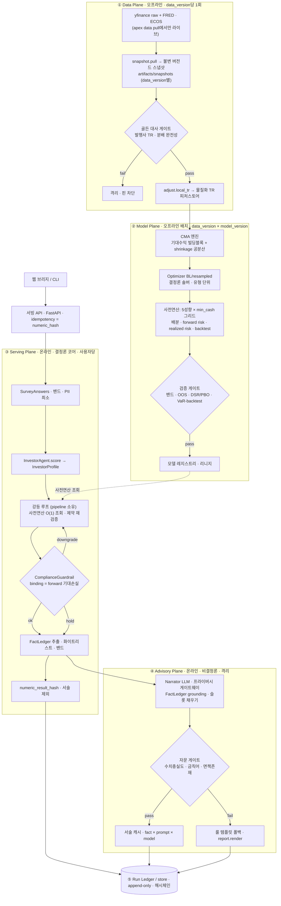

# 10. v2 파이프라인 개선 설계 (전문가 패널 반영)

8개 팀·48인 스페셜리스트 진단(내부 R3-확장 패널)을 토대로, **다음 단계(v2)에서 시작할 파이프라인 개선 설계**를 고정한다.
본 문서는 **기술 findings만** 반영한 설계 확정본이며, **규제 트랙은 §12로 분리·제외**한다.

> **범위 규정.** "규제 제외"는 *법적 규제 전략*(자문업 등록/제휴/샌드박스, 광고·성과표시 규제, 금소법 동의·설명 절차, 개인정보 처리방침·법률의견)을 뜻한다.
> 코드의 `compliance` **가드레일 모듈**(차단·강등)은 기술 컴포넌트이므로 유지·개선 대상이다. PII 밴드화는 *데이터 위생·재현성·LLM 프라이버시 게이트웨이* 관점에서 포함하되, 그 위의 *동의·고지 절차*는 규제 트랙(§12)으로 뺀다.
>
> **AI·지식 계층 반영(2026-07-17).** 온톨로지/KG·GraphRAG·LLM 설명 모델 배치를 본 설계에 정식 반영한다(§3.4·§3.7). 대원칙: **판정 경로(배분·리스크·compliance)에는 어떤 AI 모델도 붙이지 않는다.** AI는 지식·검색·설명 계층에만 — "정확도"는 두 개(판정=결정론 퀀트, 설명=grounded LLM)이고 위치가 다르다.

관련 문서: [06 아키텍처](06-architecture.md) · [08 개발계획](08-dev-plan.md) §6·§7 · [05 리스크](05-risk-metrics.md) · [09 CS 런북](09-cs-runbook.md)

---

## 0. 현재(v1) 상태 요약 — 무엇이 이미 서 있나

패널이 재확인한 v1의 **살릴 자산**과 **미완성 배선**:

| 이미 선 것 (자산) | 근거 | 미완성 배선 (v2 대상) | 근거 |
| -- | -- | -- | -- |
| 계약-우선 경계(pydantic), 순환 import 0 | `schemas/` | 피닝 스냅샷 미소비(실경로 매번 야후 재수집) | `pipeline.py:77-79` |
| 강등 역간선 1급 타입(`revised_profile`·`downgraded()`) | `compliance/__init__.py:36`, `schemas/investor.py` | `data_version`이 라이브 `tobytes()` 해시 → 표류·크로스머신 취약 | `pipeline.py:79` |
| 재현성 정규화 해시(`_canonical_hash`, 6자리) | `pipeline.py:42-60` | **설명문이 재현성 해시 안에** → LLM화 시 재현성 붕괴 | `pipeline.py:37,58` |
| 5성향·`Constraints`·min_cash 하드 가드레일 | `allocation/__init__.py:37`, `schemas/investor.py:9` | 배분이 **하드코딩 dict**(최적화·기대수익 없음) | `allocation/__init__.py:14-34` |
| 차단 지표 단일화·hold 종료(R5) | `compliance/__init__.py:26-55` | 차단 지표가 **실현 VaR**(강세장 표본→평시 ≈0) | `compliance/__init__.py:30` |
| 강등 루프를 pipeline이 소유 | `pipeline.py:93-110` | 루프가 매 반복 backtest+risk **전체 재계산**(고정 5종인데) | `pipeline.py:93-96` |
| — | — | `store/audit_log` 미구현(감사·재현·리텐션 공통 선결) | `06 §5` 계획만 |
| — | — | `currency_exposure` 하드코딩·무위험금리 상수·FX 미소싱 | `risk`·`gate` |
| — | — | CI 부재(핏함수 수동)·서빙이 CLI뿐(웹 도달 0) | `.github` 부재, `cli.py` |

---

## 1. v2 설계 원리 7 (패널 수렴)

모든 개선은 아래 7개 원리로 압축된다. 각 원리는 여러 팀이 독립적으로 도달했다.

1. **결정론 코어 / 자문 계층 분리.** 숫자·판정은 결정론·해시·감사. 서술(설명문·LLM)은 비결정론·캐시로 격리하며 **수치 해시 밖**에 둔다.
2. **핀 우선 서빙.** 런타임은 피닝 스냅샷만 읽는다. 라이브 수집은 `apex data pull`에서만.
3. **단일 진실 원장.** 모든 실행을 입력·데이터·모델·환경 버전과 함께 append-only로 봉인.
4. **교체 가능 서비스(SPI).** 각 단계는 Protocol. 룰 구현이 기본, 최적화·LLM 구현이 계약 불변으로 교체.
5. **유형 단위 사전연산.** 5성향×min_cash 그리드를 `data_version`당 1회 사전연산 → 사용자 런은 밀리초 조회.
6. **forward + realized 병기.** 차단 지표는 forward(레짐·불확실성 반영) 기대손실, 실현치는 disclosed로 병기.
7. **지식 그래프 grounding.** 설명·검색·이해의 정확도는 온톨로지/KG + GraphRAG로 올린다(§3.7). 판정·수치 정확도는 퀀트 모델(②)이 올리며 여기에 RAG/LLM/GNN은 금지.

---

## 2. v2 아키텍처 — 4 평면(Plane)

v1의 단일 프로세스 선형 파이프라인을 **4개 평면**으로 재편한다. 무거운 결정론 계산(데이터·모델)을 오프라인 배치로 내리고, 사용자 런은 조회+판정만 하며, 비결정론(LLM)은 완전 격리한다.



**핵심 변화 요지**
- **무거운 결정론 계산(①②)을 오프라인으로**: 사용자 런(③)에서 20년 백테스트를 반복하지 않는다.
- **③ 결정론 코어**: 숫자·판정만. 재현·감사·CI 강제 대상.
- **④ 자문 계층**: LLM은 여기에만. `numeric_result_hash`를 오염시키지 않는다.
- **⑤ Run Ledger**: 모든 것의 공통 토대(감사·재현·리텐션·계측).

---

## 3. 평면별 상세 설계

### 3.1 ① Data Plane — 핀 우선·골든 대사 (데이터팀)

- **불변 버전드 스냅샷.** `snapshot.pull`이 `artifacts/snapshots/{data_version}/`에 원자적·읽기전용 기록(덮어쓰기 폐지). `manifest.json`에 소스·pull 시각·라이브러리 버전·건수·대사결과·per-ticker content-hash 기록.
- **핀 소비.** `loader.load_ticker_returns`가 **라이브 대신 피닝 CSV**를 읽는다. 핀 부재 시 하드 실패(암묵 재수집 금지). 라이브 fetch는 `apex data pull`에서만.
- **골든 대사 게이트(신규).** 로컬 TR을 **발행사 공시 TR/NAV(iShares·SSGA 등) = 독립 authority**와 대조 + 채권 ETF 월배당 **분배 완전성** 대사. 통과해야만 핀 활성화(자기참조 대사 탈출).
- **FX·금리 실소싱.** FRED `DEXKOUS`·`DGS3MO`, ECOS 91일 CD를 실제 수집·피닝. `gate`의 하드코딩 `rf`, `risk`의 `currency_exposure={"USD":1.0}` 제거 → 룩스루 실계산.
- **canonical 정규화 명세.** 컬럼순서·dtype·tz(UTC)·NaN sentinel·float repr을 고정한 canonical form으로 해시 → `data_version`이 환경 간 안정.

### 3.2 ② Model Plane — CMA → 최적화 → 사전연산 (퀀트·ML/AI)

하드코딩 `MODEL_PORTFOLIOS` dict를 **문서화된 프로세스의 산출물**로 교체한다. **결정론·유형 단위·사전연산**이 세 축이다.

- **CMA 엔진(신규).** 채권 = 시작 YTM+롤다운−기대신용손실. 주식 = 배당+자사주+실질이익성장+인플레−밸류에이션 회귀(Grinold-Kroner). 공분산 = Ledoit-Wolf shrinkage(+선택적 팩터/조건부). → 강세장 실현 착시 제거.
- **Optimizer(신규).** Black-Litterman(시장균형 앵커+뷰) 또는 resampled MVO. **결정론 서빙**: 솔버 1개 고정(OSQP/Clarabel), `eps_abs/eps_rel/max_iter` 핀, `Parameter` 재사용(재컴파일 회피), 비수렴 폴백 사다리(정제→제약완화→직전 승격 모델→룰 dict). **유형 단위**(5성향)로만 최적화 → 결정론·사전연산 가능.
- **사전연산.** `(Profile × min_cash_grid)`(예: min_cash ∈ {0.0, 0.05, 0.10} → 5×3=15) 각각에 대해 배분·backtest·forward risk·realized risk를 1회 계산해 레지스트리에 저장. 사용자 런의 강등 루프는 **순수 O(1) 조회**가 된다.
- **리밸런싱 통일.** "분기 점검 + ±band 트리거" 하이브리드로 확정하고 backtest가 밴드 리밸을 실제 시뮬(현 `rebalance_band_pp` 유령 해소). 거래비용 bp·no-trade region 명시.
- **검증 게이트.** 기존 `gate.py`(07 §7 밴드·집중도·2022 MDD 사전검증)를 유지·확장 + OOS/walk-forward·Deflated Sharpe·PBO·VaR-backtest(Kupiec/Christoffersen). 통과 산출물만 레지스트리 승격.
- **모델 레지스트리·리니지.** `(data_version, cma_version, model_version, solver_version, env_hash)`를 아티팩트에 각인. 챔피언-챌린저 섀도우 승격.

### 3.3 ③ Serving Plane — 결정론 코어(신규 `run_advice`)

강등 루프를 사전연산 조회로 바꾼 새 오케스트레이터. **의사 코드:**

```python
def run_advice(cmd: AdviceCommand) -> AdviceRun:            # cmd = answers, display_currency, data_version?, model_version?, tenant?
    dv = cmd.data_version or registry.latest_data_version
    mv = cmd.model_version or registry.latest_model_version
    precomp = registry.load_precomputed(dv, mv)             # {(Profile, min_cash_level): PrecomputedType}

    profile = investor.score(cmd.answers)                   # SPI: InvestorAgent (결정론)
    path, breaches, decision, alloc, rr = [], [], "hold", None, None

    for _ in range(6):                                      # 사다리 유한 → 반드시 종료
        base = precomp[(profile.profile, level(profile.constraints.min_cash))]   # O(1) 조회, 재계산 없음
        alloc = allocation.apply_constraints(base.allocation, profile.constraints) # 제약 재검증(밴드·집중도·min_cash)
        rr    = risk.assemble(base, alloc, cmd.display_currency)                   # forward binding + realized disclosed + 통화 룩스루
        dec   = compliance.check(rr, profile)              # binding = forward 기대손실(§3.5)
        breaches += dec.breaches
        if dec.decision == "ok":   decision = "ok";   break
        if dec.decision == "hold": decision = "hold"; alloc = rr = None; break
        path.append(dec.downgrade_reason); profile = dec.revised_profile

    ips_doc  = ips.render(profile, alloc, cmd.answers, rr) if decision == "ok" else None
    ledger   = fact_ledger.extract(profile, alloc, rr, decision, breaches)         # 화이트리스트·밴드·PII 없음
    numeric  = NumericResult(decision, profile.profile, alloc, rr, ips_doc, ledger,
                             schema_version=SCHEMA_V, model_version=mv, data_version=dv, env_hash=ENV_HASH)
    numeric_hash = canonical_hash(numeric)                 # 서술 미포함(§7)

    narrative = advisory.narrate(ledger)                   # ④ 격리 계층(LLM 또는 룰 폴백)
    run = AdviceRun(numeric=numeric, narrative=narrative,
                    numeric_hash=numeric_hash, narrative_hash=hash(narrative), provenance=...)
    store.append(run)                                      # ⑤ Run Ledger(append-only)
    return run
```

핵심: `allocation.build(하드코딩)` → `allocation.apply_constraints(사전연산 배분, constraints)`. 루프는 조회+제약 오버레이+판정뿐이라 밀리초. min_cash 오버레이가 밴드를 깨면 `apply_constraints`가 breach로 표식(현재 미검증 지점 해소).

### 3.4 ④ Advisory Plane — LLM 격리 (ML/AI)

- **FactLedger.** `NumericResult`에서 인용 가능한 값만 뽑은 화이트리스트(성향 라벨·밴드 수치·계산 지표·decision·강등경로). **원값 PII·개별 금액 없음**(밴드 수준). LLM의 유일한 진실 소스.
- **Narrator(교체 가능, `DETERMINISM_REQUIRED=False`).** Claude를 **프라이버시-네이티브 게이트웨이**(비식별 egress·서울 리전 또는 ZDR) 뒤에서 호출. **구조화 출력(슬롯 채우기)** — 숫자는 우리가 주입, LLM은 연결 서술만.
- **자문 게이트(발행 전).** ① 수치충실도(모든 숫자 ∈ FactLedger, 창작 = 폐기) ② 금칙어·톤(단정예측·수익보장·개인지시형) ③ 면책·프레이밍 존재. 하나라도 실패 → **룰 템플릿(현 `report.render`)으로 무손실 폴백**.
- **캐시 결정론.** `(fact_ledger_hash × prompt_version × model_id)` 키로 서술 캐시. 동일 입력이면 캐시 서술 그대로 → "동일 입력=동일 리포트" 유지. (`temperature=0` 결정론은 최신 Claude에서 성립 안 함 — 재현성은 **캐시**로 확보.)
- **`narrative_hash`**는 감사용, `numeric_result_hash`에 **미포함**.

#### 3.4.1 AI 모델·기술 배치 (Step 2·3에서 이대로 구현)

| 계층/부분 | 붙일 것 | 모델 ID / 기술 | 비고 |
| -- | -- | -- | -- |
| 판정(숫자·배분) | 통계·최적화 | Ledoit-Wolf + cvxpy/Clarabel | **AI 없음**(재현성·규제) |
| 온톨로지 검증 | 결정론 | rdflib/OWL + pySHACL | §3.7 자리1 |
| 온톨로지 추출(1회 배치) | LLM+인간검토 | `claude-opus-4-8` + structured outputs | §3.7 구축 |
| 임베딩(문서·정의) | 벡터 | BGE-M3(자체호스팅) / Voyage `voyage-3.5` | **Anthropic 임베딩 API 없음**. 한국어+프라이버시→자체호스팅 |
| GraphRAG 검색 | 그래프+벡터 | Cypher/SPARQL + LlamaIndex PropertyGraphIndex | 무거운 MS GraphRAG는 v3 |
| 표준 서술(ok·대량) | LLM | `claude-sonnet-5` ($3/$15, 도입 $2/$10~2026-08-31) | 품질/비용 균형 |
| 민감 서술(hold·강등·취약자) | LLM | `claude-opus-4-8` ($5/$25) | 뉘앙스·안전 |
| 가드레일 분류(개인지시·규제발화) | LLM | `claude-haiku-4-5` ($1/$5) | 매 턴 in/out·저지연 |
| 자문 게이트 judge(사실성·톤) | LLM | `claude-opus-4-8` + **Batch(−50%)** | 야간 배치 |

기본값: 불확실하면 전부 `claude-opus-4-8`(레퍼런스 권장). **거부**: `claude-fable-5`($10/$50, 과투자), LLM 파인튜닝(재현성·비용 악화), 판정 경로 RAG/LLM/GNN.

#### 3.4.2 grounding·재현성·배포 제약 (구현 전 필수 인지)

- **grounding 두 경로 — 한 호출 병용 불가**(`citations` + `output_config.format` = 400): 리포트 본문 = **structured outputs**(숫자 슬롯을 우리가 주입 → 창작 원천 차단) / "왜?" Q&A = **Citations**(`cited_text` 인용 → 추적가능). 두 경로를 분리 호출.
- **재현성**: 최신 Claude는 `temperature` 제거(400) → 결정론은 **캐시**(`fact_ledger_hash × prompt_version × model_id`)로. 프롬프트 캐싱은 온톨로지·시스템프롬프트를 프리픽스로(캐시읽기 ~0.1x), FactLedger 값은 브레이크포인트 **뒤**.
- **배포**: 기본 = 1P Claude API + `inference_geo`(데이터 거주지 · Batch·자동캐싱·Files 지원). 파트너 인리전 강제 시 = Amazon Bedrock 서울(`AnthropicBedrockMantle`, `ap-northeast-2`, 모델 ID `anthropic.` 접두 — 단 Batch·자동캐싱 미지원).

### 3.5 ③의 compliance 가드레일 개선 (기술)

| 항목 | v1 | v2 |
| -- | -- | -- |
| 차단(binding) 대상 | `risk.var95_annual` = 실현 롤링·√스케일(강세장 표본→평시 ≈0) | `risk.expected_loss_1y_forward` = **CMA μ + 레짐/shrinkage Σ + 불확실성 밴드**의 보수 꼬리 기대손실 |
| 실현 지표 | (동일 지표를 차단에 사용) | `var95_annual`·MDD는 **disclosed**로 병기(차단 아님, R3 정책 유지) |
| 집중도·밴드 | risk가 계산만, 판정 미사용 | compliance가 **하드캡으로 검증**(단일ETF≤30%·자산군 밴드·현금 하한) → breach |
| 통화노출 | 하드코딩 USD 100% | 룩스루 실계산(EFA/EEM 기초통화 분해), 원화 투자자 관점 |

효과: 차단 게이트가 out-of-sample에서도 리스크를 정직하게 적립 → "성향 위반 0건"이 강세장 표본에 기대지 않는다. **강등 사다리·hold 종료 로직 자체는 불변**(이미 1급).

### 3.6 ⑤ Run Ledger / store (아키텍트·컴플·데이터 공통)

- **`store/` 실구현.** 06 §5 6테이블을 append-only 온디스크(JSON→후에 SQLite/DB). 매 런 = `{run_id, created_at, actor?, tenant?, input_snapshot_id, data_version, model_version, schema_version, env_hash, decision, downgrade_path, breaches, numeric_result_hash, narrative_hash, prompt_version, gate_results}`.
- **불변·해시체인.** 각 레코드가 직전 해시 포함 → 변조 탐지. WORM 지향.
- **`apex replay --run-id`.** 원장에서 `(data_version, model_version, schema_version, env_hash)`를 복원해 재실행 → 수치필드 `rtol≤1e-6` 재현 + diff 리포트. "재현성"이 주장에서 실행 명령이 된다.

### 3.7 Knowledge Plane — 온톨로지/KG (신규 · ML·AI 레인)

"여러 변수의 유기적 관계"(자산↔자산군↔리스크팩터↔통화↔성향↔제약↔시나리오↔벤치마크)를 **명시적 그래프**로 세운다. **두 자리**에서 값을 낸다.

- **자리 1 — 결정론 검증(LLM 아님).** 그래프 제약(SHACL/그래프쿼리)이 ③ Serving·②의 검증을 강화한다: 팩터 레벨 집중도(`Asset→loadsOn→Factor`), 룩스루 중복(`SPY overlaps QQQ`), 통화노출(`Asset→exposedTo→Currency`, 하드코딩 USD 제거), 밴드 정합(`Portfolio→holds→AssetClass` vs `Profile→hasBand`), 시나리오 일관성(`Scenario→shocks→Factor→loadsOn`). → 퀀트 findings를 기계검증화(수치 정확도에도 기여).
- **자리 2 — grounding 백본.** `FactLedger` + 이 KG + 문서(05 정의·07 자산군·IPS)가 ④ Advisory GraphRAG의 grounding 소스. 관계 다홉 질문("왜 안정형인데 2022 −20%?" → 채권 듀레이션 팩터 → 2022 금리충격)에 **추적가능한** 근거·경로.

온톨로지 스케치(FIBO 정렬 · 경량 시작 — `universe.py`·07 §2·05 §3의 암묵 관계가 이미 ~70% 존재):

```text
엔티티 : Asset · AssetClass · RiskFactor · Currency · Region
         · Profile · ModelPortfolio · Constraint · Metric · Scenario · Benchmark
관계   : Asset —belongsTo→ AssetClass · —loadsOn→ RiskFactor{w} · —exposedTo→ Currency
         · —overlaps→ Asset{lookthrough}
         ModelPortfolio —holds→ Asset{w} · —forProfile→ Profile
         Profile —hasBand→ AssetClass{min,max} · —hasLimit→ Metric
         Scenario —shocks→ RiskFactor{mag} · Benchmark —proxies→ Asset(TR)
```

- **구현**: 경량 시작 = `rdflib`(OWL) + `pySHACL` 검증(또는 타입드 pydantic 그래프). 확장 = Neo4j / Ontotext GraphDB(FIBO 네이티브). FIBO 전체 정렬·대규모 GraphRAG(reranker 등)는 v3(§12).
- **거부**: 관계를 학습된 GNN 임베딩으로 대체 — 블랙박스·감사 불가. 명시적 온톨로지가 이 프로젝트(결정론·추적)에 맞다.

---

## 4. 계약(스키마) 변경

| 스키마 | 변경 | 이유 |
| -- | -- | -- |
| **전 산출 모델** | `schema_version`, `data_version`, `env_hash` 필드 추가; `model_version` 누락분 추가 | 08 §6 재현성 2체크포인트를 타입이 강제 |
| `RiskReport` | `expected_loss_1y_forward`(binding) 추가; `var95_annual`·MDD는 disclosed 유지; `currency_exposure` 실계산; `calc_currency`/`display_currency` 분리; `sortino`·`information_ratio`·`benchmark_relative` 추가 | §3.5 차단 지표 교체 + 성과·통화 정합 |
| `ComplianceDecision` | 상관 `model_validator`(downgrade⟹`revised_profile` 존재, hold⟹None); 집중도 breach 지원 | 크래시 방지 + 하드캡 강제 |
| `Allocation` | `profile: str` → `Profile`(enum); `apply_constraints` 결과에 breach 표식 | 타입 안전·min_cash 밴드 검증 |
| `PipelineResult` | **분리**: `NumericResult`(해시 대상) + `Narrative`(자문, 해시 제외). `decision: Literal["ok","hold"]`, `final_profile: Profile` | LLM 격리의 물리적 전제(§7) |
| **신규** | `CMASet`, `PrecomputedType`(레지스트리), `FactLedger`, `RunRecord`(원장) | ②④⑤ 평면 계약 |

---

## 5. SPI — 교체 가능 서비스 인터페이스 (아키텍트·ML/AI)

각 단계를 `typing.Protocol`로 세우고 pipeline이 **구현 대신 인터페이스에 의존(DI)**한다. 룰 구현이 기본 어댑터, v2 최적화·LLM 구현이 계약 불변으로 교체.

```python
class InvestorAgent(Protocol):     DETERMINISM_REQUIRED = True;  def score(self, a: SurveyAnswers) -> InvestorProfile: ...
class Optimizer(Protocol):         DETERMINISM_REQUIRED = True;  def solve(self, cma: CMASet, c: Constraints) -> dict[str,float]: ...
class AllocationEngine(Protocol):  DETERMINISM_REQUIRED = True;  def apply_constraints(self, base: Allocation, c: Constraints) -> Allocation: ...
class RiskEngine(Protocol):        DETERMINISM_REQUIRED = True;  def assemble(self, base, alloc, ccy) -> RiskReport: ...
class ComplianceGuardrail(Protocol):DETERMINISM_REQUIRED = True; def check(self, r: RiskReport, p: InvestorProfile) -> ComplianceDecision: ...
class Narrator(Protocol):          DETERMINISM_REQUIRED = False; def narrate(self, f: FactLedger) -> str: ...   # LLM 허용
```

**CI 불변식**: `DETERMINISM_REQUIRED=True` 모듈의 import 그래프에 `apex.advisory`/`anthropic`이 없음을 테스트로 강제("배분·판정에 AI 금지"를 PDF가 아니라 통과하는 테스트로).

---

## 6. 재현성 아키텍처 — 해자를 실체로 (데이터·아키텍트·ML/AI 공통 한 방)

| 축 | v1 결함 | v2 처방 |
| -- | -- | -- |
| 입력 | 피닝 미소비·라이브 재수집 | **핀 소비**(§3.1), `data_version` = 매니페스트 해시 |
| 해시 | `tobytes()`(크로스머신 취약)·서술 포함 | **단일 canonical 해시**(§3.1), `numeric_hash`는 `NumericResult`만 |
| 환경 | BLAS 핀 문서만 | 프로세스 진입 `OMP/MKL/OPENBLAS=1` + `env_hash` 각인 |
| 서술 | LLM화 시 재현성 붕괴 | 서술은 해시 밖 + 캐시 결정론(§3.4) |
| 증명 | 재계산만 | **`apex replay`** + append-only 원장(§3.6) |

---

## 7. 서빙 표면 — CLI 탈출 (프론트·PM·아키텍트)

- **얇은 서비스 계층.** `run_advice(cmd)`를 유일 유스케이스 진입점으로. CLI·웹 브리지·(후일)파트너 API가 전부 이걸 호출.
- **Contract-first API(FastAPI).** pydantic이 곧 OpenAPI. `POST /v1/advice-runs`(멱등키 = `numeric_result_hash`), `GET /v1/advice-runs/{id}`, `GET /.../{id}/report`. hold는 200 + `decision:"hold"`.
- **웹 브리지.** 설문 폼 제출 → 서버가 `run_advice` 실행 → HTML 리포트 즉시 반환(터미널 제거, "CLI 절벽" 해소).
- **멱등·리플레이.** 같은 입력·같은 `data_version`이면 원장에서 기존 런 반환(재계산 0).

---

## 8. CI 핏함수 게이트 (아키텍트·테스트 — GREEN을 참으로)

`.github/workflows`에 병합 차단 게이트로:

1. **재현성** — 핀 스냅샷·`OMP=1` 하 **별도 2프로세스** 실행 → `numeric_hash` 동일 + 수치필드 `rtol≤1e-6`.
2. **결정론 경계** — 코어 모듈이 advisory/LLM을 import하면 실패(§5).
3. **성향 위반 0건** — property test를 **합성 → 실 피닝 데이터**로(현 `test_property`는 synthetic).
4. **계약 정합** — `schema_version` 존재·JSON Schema 스냅샷 diff.
5. **골든 데이터 대사** — 발행사 TR 대조(§3.1).
6. **수치 충실도** — 서술의 모든 숫자 ⊆ FactLedger(§3.4).
7. **면책·프레이밍 존재** — 렌더 산출물에 고지 존재(빌드 실패 게이트). *문구 내용*은 규제 트랙(§12) 소관.

---

## 9. 착수 순서 (구현 스텝)

각 스텝은 앞 스텝의 배선 위에 선다. Step 0은 대부분 "며칠 배선"(재작성 아님).

- **Step 0 — 재현성 실체화 (며칠~1주).** 핀 소비(`loader`+`snapshot.load_pinned`) · `data_version`=매니페스트 · `tobytes` 제거→canonical 해시 · **`NumericResult`/`Narrative` 분리**(explanation/reelicitation을 해시 밖으로) · `store/` 최소 원장 · CI(재현성·결정론경계·property-real) · env 핀. → *"M4~M6 완료"가 처음으로 참이 됨.*
- **Step 1 — 계약·SPI (1주).** 전 모델 `schema_version`/버전 전파 · `ComplianceDecision` validator · `Allocation.profile→Profile` · SPI Protocol + pipeline DI.
- **Step 2 — Model Plane + Knowledge (2~4주).** CMA 엔진(Ledoit-Wolf) · FX/금리 실소싱(하드코딩 제거) · Optimizer(cvxpy/Clarabel·유형단위) → 사전연산 그리드 · 레지스트리 · forward risk + realized · **compliance binding 지표 교체**(§3.5) · 검증 게이트(DSR/PBO/VaR-backtest) · 골든 대사(§3.1) · **경량 온톨로지/KG(§3.7) + 결정론 관계검증**(집중도·룩스루·통화·밴드·시나리오).
- **Step 3 — Serving + Advisory (2~3주).** `run_advice`(사전연산 O(1) 루프) · FactLedger · Advisory Plane(LLM 게이트웨이+게이트+캐시+폴백) · **모델 배치(§3.4.1)**: 표준=`claude-sonnet-5`·민감=`claude-opus-4-8`·가드레일=`claude-haiku-4-5`·judge=`claude-opus-4-8` batch · **GraphRAG grounding(§3.7 자리2 · structured outputs/Citations 분리 §3.4.2)** · FastAPI 서비스 + 웹 브리지 · `apex replay`.

> **규율(PM 레인).** 폭(개별종목·세금·다통화·RL)을 Step 0~3에 **하나도 넣지 않는다.** 지금 넣으면 결정론·재현성 토대가 서기 전에 무너지고, v3(§12)의 폭은 자격·검증 후에만.

---

## 10. v1→v2 파이프라인 대조 (한 눈)

```text
v1:  answers → score → build(dict) → backtest(재계산) → risk(실현VaR·USD고정) → compliance
                          ↺ 강등 시 전체 재계산 ×N
              → ips → report(explanation ∈ 해시) → PipelineResult(라이브 tobytes data_version)

v2:  [오프라인] pull(핀·골든대사) → TR → CMA → optimize(유형·결정론) → 사전연산(성향×min_cash) → 검증 → 레지스트리
     [온라인 ] answers → score → 강등루프{조회 O(1) + 제약재검증 + forward-binding compliance}
                       → FactLedger → numeric_hash(서술 제외) → store(원장)
                       ↳ [격리] Narrator(LLM·grounding·게이트·캐시) 또는 룰 폴백
     [표면  ] run_advice ← FastAPI ← 웹 브리지/CLI  ·  apex replay(원장 재현)
```

---

## 11. 완료기준 매핑 (검증 가능하게)

| 기준 | v2 검증 |
| -- | -- |
| 재현성 100% | 핀 스냅샷 하 별도 2프로세스 `numeric_hash` 동일 + `rtol≤1e-6`(CI 게이트 §8-1) |
| 성향 위반 0건 | **실 피닝 데이터** property test(CI §8-3) — binding=forward 기대손실 기준 |
| 배분 근거 | "왜 이 비중?" → CMA·optimizer·레지스트리 리니지로 답(§3.2) |
| 감사·재현 | `apex replay --run-id` 왕복 재현 + 원장 해시체인(§3.6) |
| AI 안전 | 코어 결정론 경계 CI + 수치충실도 게이트(§5·§8) |
| 사용자 도달 | 무터미널 웹 브리지(§7) |
| ≤3분 SLA | 사전연산으로 사용자 런 밀리초(§3.2·§2) |

---

## 12. 명시적 범위 밖 (본 설계 제외)

### 규제 트랙 (별도) — 진단 보고서 참조
- 투자자문업 등록 / 인가사 B2B 제휴 / 규제 샌드박스 경로.
- 투자광고·가상성과 표시 규제, 금소법 6대 원칙 절차, 동의 게이트·개인정보 처리방침, 자문업 경계 법률의견.
- *주*: 본 설계의 FactLedger(밴드·PII 없음)·유형 단위 최적화·면책 존재 게이트는 **기술적으로도** 타당(PII-free 재현성·결정론·무손실 폴백)해 채택했으나, 그 위의 *법적 절차·인가*는 규제 트랙 소관이다.

### v3 폭 (자격·검증 후)
- 개별종목 유니버스(point-in-time·생존편향 데이터 전제), 세금·계좌인지 최적화, 이중통화 전량 재계산, RL 배분(결정론·설명가능성 리스크로 신중론).
- **지식·AI 확장**: FIBO 전체 정렬, 대규모 GraphRAG 인프라(Neo4j/GraphDB·reranker), 리포트 Q&A 챗(Citations grounded).

---

## 13. 다음 액션

승인 시 **Step 0(재현성 실체화)**부터 착수한다. 이 단계가 통과해야 나머지 평면이 참인 토대 위에 선다.
Step 0의 단일 최대 지렛대는 **핀 소비 + `NumericResult`/`Narrative` 해시 분리 + `store/` 원장** 세 배선이며,
이는 새 알고리즘이 아니라 이미 계산되는 산출물을 연결·저장하는 작업이다.
