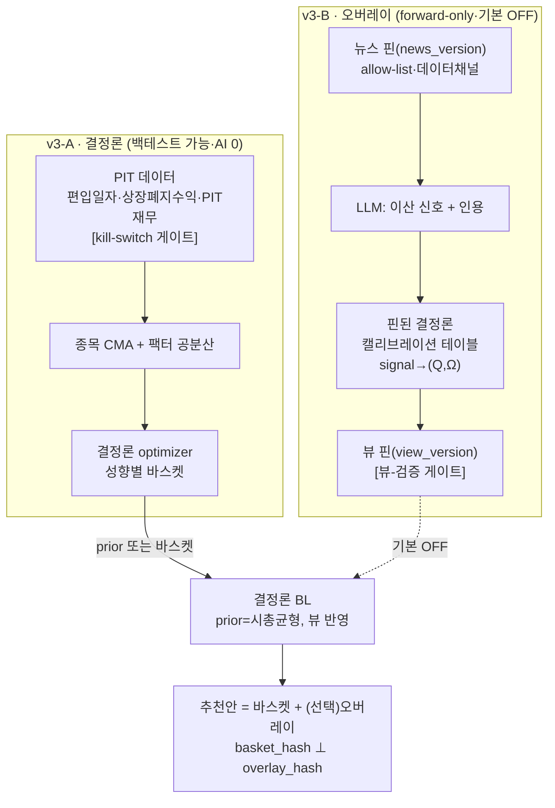

# 13. v3 설계 — 개별종목: 결정론 엔진(v3-A) + 뉴스·선호 오버레이(v3-B)

이 문서는 **v3(폭 확장)의 how**를 고정한다. [10 §12 v3 폭](10-v2-pipeline-design.md)을 실체화하며, 북극성([11](11-direction.md))의 "뼈대 교체" 정신·재현성·감사 규율은 잇는다.

> **성격.** 현 단계 = **혼자 보는 분석·추천 도구(비배포)**. 규제는 하드 제약이 아니라 **문서화된 미래 게이트**(§6·배포 시 재활성). [11 §5](11-direction.md) 중 **재현성·감사·anti-환각은 유지**, 규제·프레이밍 게이트는 **유지하되 명시 override 가능**(§6).
>
> **결정(2026-07-19, 5인 패널 검토 반영).** ① **v3-A(결정론 종목 엔진·백테스트 가능) / v3-B(뉴스·선호 오버레이·forward-only) 물리 분리**(§2). ② **AI는 *이산 신호*만, 핀된 결정론 캘리브레이션 테이블이 (Q,Ω) 생성** — LLM은 연속 숫자 금지(§4.1). ③ **Step 0 정량 kill-switch** — 데이터 무결성 바 미달 시 백테스트 주장 철회·forward-only 격하(§3.1). ④ **규제·안전 게이트 유지하되 override 가능**(§6).

관련: [11 §5·§6](11-direction.md) · [10 §3.2(BL·MVO)·§3.4·§3.6(replay)·§5(SPI)·§12](10-v2-pipeline-design.md) · [12 지식그래프](12-knowledge-graph-compliance.md) · [07 §6 테마](07-asset-classes.md) · `tools/sp500`(840 union) · `src/apex/optimizer.py`(현 MVO·BL 부재)·`data/membership.py`(현행 dict)·`graph.py`

---

## 1. 한 줄 방향 & 헤드라인 정정

> **"개별종목을 *결정론으로* 얹어 백테스트 가능한 바스켓을 세우고(v3-A), 그 위에 뉴스·선호를 *신호(view)*로 얹은 오버레이(v3-B)는 forward-only 실험으로 분리한다. 검증되는 것과 차별화되는 것은 서로 다른 트랙이며, 하나의 해시로 섞지 않는다."**

**정정(패널 지적).** 이전 초안의 "그래서 추천이 백테스트된다"는 문서 스스로의 "뉴스=forward-only" 인정과 **내적 모순**이었다. 실제로 백테스트되는 건 결정론 바스켓(v3-A)이고, 뉴스·선호 틸트(v3-B)는 PIT 뉴스 부재로 **소급 검증 불가**다. 이 경계를 흐리지 않는 것이 v3 설계의 1급 규율이다.

## 2. 두 트랙 분리 (핵심 구조)

패널 6개 수렴(가치역설·재현성·생존편향·인젝션·범위규율·해시오염)이 **한 뿌리** — "검증체제가 다른 둘을 섞음" — 에서 나왔다. 물리 분리로 동시 해소한다.

| | **v3-A · 결정론 종목 엔진** | **v3-B · 뉴스·선호 오버레이** |
| -- | -- | -- |
| 무엇 | PIT 데이터 → 종목 CMA → optimizer → 성향 바스켓 | 뉴스·선호 → 이산신호 → 캘리브레이션 → BL 뷰 → 틸트 |
| AI | **0** (통계·최적화만) | LLM(이산 신호 + 인용만, 숫자 금지) |
| 백테스트 | **완전 가능**(PIT 시세·편입일자·PIT재무 전제) | **불가**(forward-only) |
| 해시 | `basket_numeric_hash`(결정론 재계산) | `overlay_hash`(뷰 핀 ID) — **분리** |
| 기본 상태 | 항상 ON | **기본 OFF**(forward 증거 전) |
| 검증 | DSR/PBO·생존편향 OOS | forward 성과추적 원장 + 바스켓 대비 초과성과 |

## 3. v3-A — 결정론 종목 엔진 (백테스트 가능)

### 3.1 PIT 데이터 무결성 + kill-switch 게이트 (Step 0)

시기별 백테스트는 "그 시점 실제 지수 구성"을 알아야 하며, **편입/편출 *일자*가 필수**다. **패널 확인**: `tools/sp500`은 PIT 복원기가 아니라 union 생성기(`parse_removed()`가 편입일자 미파싱, 재편입을 "현재"로 붕괴) → Step 0은 **정밀화가 아니라 신축**이다.

- **신규 PIT 리컨스트럭터.** 위키 "Selected changes" add/remove 이벤트를 **양쪽 날짜와 함께** 스트림으로 흡수 → 종목별 **다구간 인터벌** `[{in_date, out_date}]` 생성.
- **안정 식별자(CIK).** 티커 문자열 키는 재사용(GM 2009 파산/2010 IPO)·변경(FB→META)에서 깨짐 → **SEC CIK를 1급 식별자**, 티커는 as-of 속성으로 강등.
- **소스 리비전 핀.** 위키 `oldid` + GitHub 데이터셋 커밋 SHA를 `membership_version`에 편입(현재 미핀 = 재현성 자기위반). 원문 HTML raw 스냅샷 피닝. 소스 불일치 = 하드 실패.
- **편출사유 3분류.** M&A(인수가/현금대체) · 파산(회수율 근사) · 리밸런싱(계속 거래) — 사유별 **종료수익 규칙**. "마지막 가격 −100% 드롭"은 **방향부터 틀림**(대부분 M&A 프리미엄). 근사 불가 구간은 **명시 제외 + 제외로 인한 편향 상한 리포트**.
- **발표일 vs 유효일** 구분(off-by-N일 = look-ahead 주입).
- **PIT 재무 절단선.** as-reported+보고일자는 무료로 **EDGAR XBRL ~2009+**만 현실적. 그 이전은 look-ahead → 백테스트 시작을 재무 커버리지에 맞춰 절단하거나 축소추정 대체. restated vs as-first-reported 차이 골든 종목으로 실측·각인.

**kill-switch 정량 게이트(결정④·③).** 아래 바를 통과해야 **"백테스트 가능"을 주장**하고 Step 1 착수:

| 지표 | 바(예시, 실측 후 확정) |
| -- | -- |
| 지수 구성원 수 불변식 | 모든 날짜 복원 구성원 ≈ 500 (±지수 이벤트) — **membership판 골든 대사** |
| 상장폐지 종료수익 커버리지 | 편출 종목 중 종료수익 배정 가능 비율 ≥ 바 |
| PIT 재무 결측률 | 종목·연도 커버리지 ≥ 바 |
| 소스 2계보 교차 | 위키 oldid + GitHub SHA 일치 검증 통과 |

미달 시 → **백테스트 주장 철회, "forward-only 종목 분석"으로 격하**(정직한 격하가 게이트의 목적).

**✅ Step 0 완료(2026-07-21).** ([`membership_pit.py`](../src/apex/data/membership_pit.py)·[`membership_crosscheck.py`](../src/apex/data/membership_crosscheck.py)·[`fundamentals_pit.py`](../src/apex/data/fundamentals_pit.py)·[`delisting_returns.py`](../src/apex/data/delisting_returns.py), 테스트 31, ruff clean):
- **위키 리컨스트럭터**(다구간·CIK·oldid 핀·M&A/파산 사유분류) — **M&A 172 vs 파산 4**로 "−100% 드롭 방향 오류" 실증.
- **⚠️ 정정: GitHub이 권위 소스.** 2계보 교차검증(fja05680/sp500, 1996~현재, 커밋 SHA 핀)에서 **위키 단독은 과거로 갈수록 크게 누락**(2006년 462 vs 497) → **GitHub=as-of 권위, 위키=CIK·사유 보강 + 교차검증**으로 재배치.
- **EDGAR PIT 재무**(data.sec.gov XBRL) — **공시일자(filed)와 함께** 추출, `filed≤T`만 사용해 look-ahead 제거, 최초 filed=as-first-reported/이후=restatement. 태그 시기변경 병합. **핵심 span-adjusted 커버리지 94.8%**(표본 40종), ~2009+(§6 절단선 실증).
- **편출 종료수익 근사** — 사유매핑(M&A=시장가청산·파산=총손실·리밸=계속거래), 399건 100% 커버. **모든 값에 `is_approximation=True`·`method`·`source`·`confidence` 각인 → 실 종료수익(CRSP/인수가)으로 `(ticker,out_date)` 키 개별 교체 가능**(북극성 "뼈대 교체").
- **kill-switch verdict = `backtest_ok_provisional`** (5🟢·1ℹ️): 구성원수 불변식(GitHub)·소스 2계보·인터벌 이상치 0·PIT 재무(EDGAR)·종료수익 커버 모두 통과. **"provisional"은 종료수익이 근사라는 뜻 — 실데이터 교체 시 `backtest_ok`.** 정직한 티어 구분.
- **잔여(교체·확장)**: 종료수익 저신뢰 76건(other 사유) 실데이터 우선 교체 · 배당/자사주 개념 확장(전 Grinold-Kroner) · 재무 전 유니버스 풀 · 편출종목 CIK(위키 변경표 미제공).

**✅ v3-A Step 1 완료(2026-07-21) — Tier 0 종목 룩스루 분석.** ([`graph.stock_exposure_lookthrough`](../src/apex/graph.py)·[`lookthrough.py`](../src/apex/lookthrough.py)·[`schemas/lookthrough.py`](../src/apex/schemas/lookthrough.py), 테스트 7):
- 예시 ETF 포트 → **실효 개별종목 노출**(배정×보유, 이중계상 없음 §8) + 집중도(top/top5/HHI) + 테마 룩스루 + 통화 룩스루 + **단일종목 집중 경고**(disclosed, UCITS 10% 준용).
- **Tier 0 경계 준수**: 종목은 분해·근거로만 등장, **배분·`numeric_hash` 밖**([§2·§3](#) 규제 안전). `LookthroughReport`는 disclosed 분석(판정 아님).
- **정직한 커버리지**: holdings top-N·해외종목 미매핑으로 부분 룩스루(예시 포트 28.8%). **loadsOn 팩터 분해는 팩터 데이터 필요 → Step 2**(종목 CMA)로 이월.
- 실측 예시(SPY45/QQQ20/EFA10/EEM5/IEF15/GLD5): 최대 단일종목 NVDA 4.9%·top5 16.5%, 테마 AI_HW 13.9%, 통화 USD 87%. **pytest 174·ruff clean.**

**✅ v3-A Step 2 완료(2026-07-21) — 종목 CMA·optimizer·이벤트 백테스트.** ([`stock_cma.py`](../src/apex/stock_cma.py)·[`stock_optimizer.py`](../src/apex/stock_optimizer.py)·[`stock_backtest.py`](../src/apex/stock_backtest.py)·[`data/stock_prices.py`](../src/apex/data/stock_prices.py), 테스트 15):
- **표본 주가 핀**(24 대형종목·10년, yfinance 소량·딜레이) — 대량은 야후 429 벽, 표본으로 엔진 검증(EDGAR·종료수익과 동일 정직 패턴).
- **종목 CMA = Grinold-Kroner**: EDGAR as-first-reported(배당·자사주·순이익성장) + 주가 시총 → μ. **강한 μ shrink**(NVDA 성장 32%→11% 축소, 종목 μ 잡음 통제). Σ = **constant-correlation Ledoit-Wolf**(identity 타깃 금지 — 팩터구조 보존, 패널 [Med]).
- **종목 optimizer = 유형단위 예시 바스켓**(성향 λ 위험회피 + 단일종목 캡 10%). 단조: 초안정 E[r]9.3%/vol14.4% → 공격 12.8%/18.1%. 이 산출물은 Tier 2 판정 → numeric_hash 안(종목=판정, docs/13 §3).
- **이벤트 구동 백테스트**: 분기 리밸·**가변 유니버스**(as-of membership)·**상폐 현금화**(종료수익) — 기존 `loader`(공통창 강제) 불가를 해소(패널 [High]). DSR 다중검정 게이트(validation.py).
- **⚠️ 정직 한계**: 표본=현행 대형 24종(**생존편향**)+강세장 10년 → 백테스트 CAGR 15~18%는 낙관. 엔진은 편출/상폐 지원(합성 검증)하나 표본이 편향 → **전 PIT 백테스트는 전 유니버스 주가(벽) 필요**. **PBO/CSCV 미구현**(DSR·walk-forward만, 패널 [Med] 잔여) · loadsOn 명시 팩터모델·밸류에이션 회귀는 확장 여지.
- **다지기(재현성 증명)**: [`stock_pipeline.py`](../src/apex/stock_pipeline.py) 오케스트레이터가 핀→CMA→바스켓→백테스트→`numeric_hash`를 한 진입점으로 조립. **별도 2프로세스 실행이 동일 numeric_hash**(재현성 2체크포인트 [11] §5.8, 종목 엔진에 성립). 핀 부재 시 하드 실패(§5.3). 결정론 경계 CI(anthropic/advisory 미import)는 신규 모듈 자동 커버.
- **유니버스 정합 검증**: 표본 24종이 **PIT현행·CIK·테마·주가·재무 전 층 완전 연결(갭 0)**, **PIT membership(GitHub 권위) ↔ 테마 membership(위키 E1) 현행 503종 정확 일치**(독립 2소스 합치 = 유니버스 골든). 회귀 방지 테스트 등재. **pytest 196·ruff clean.**

**🔨 v3-B Step 3 심장부 착수(2026-07-21) — AI 신호 → 결정론 (Q,Ω) → BL 틸트.** ([`signal_calibration.py`](../src/apex/signal_calibration.py)·[`black_litterman.py`](../src/apex/black_litterman.py)·[`signal_overlay.py`](../src/apex/signal_overlay.py), 테스트 14):
- **신호 캘리브레이션 테이블**(§4.1): LLM은 이산 신호(strong_neg..strong_pos)만, **핀된 결정론 테이블이 (Q,Ω) 변환** — 숫자가 LLM 밖 → 환각 게이트 복원(패널 5인 만장). Ω 하한 불변식(과확신 차단).
- **BL 엔진 신규 구축**(§4.2, 패널 [High] "optimizer에 BL 부재" 해소): **prior = CMA GK μ**(순환 아님 — μ는 추정치이지 바스켓 아님) → **null-view 항등성**(신호 없으면 posterior=μ 정확 → optimize도 Step 2 바스켓 정확 일치). 시총균형 앵커는 대안 제공.
- **신호 오버레이**(§4.3): **기본 OFF**(신호 없으면 Step 2 바스켓 정확) · **뷰-검증 게이트**(허용 어휘·알려진 티커만, 미지→폐기) · **해시 물리 분리**(`basket_hash`는 신호와 무관·불변, `overlay_hash`만 신호 반영 — 코어 해시가 AI를 절대 안 담음, 패널 [High]) · 신호 SPI(기본 `NullSignalSource`=OFF).
- **잔여**: LLM 뉴스→이산신호 어댑터(프롬프트 인젝션 위협모델·allow-list·인용 §4.3) · Step 4 forward 성과추적 · 뉴스 WORM 핀. **pytest 210·ruff clean · 결정론 경계 통과(v3-B 모듈 AI import 없음).**

### 3.2 종목 CMA · 팩터 공분산 · optimizer · 이벤트 백테스트 (Step 1~2)

- **종목 CMA.** 팩터 μ(GK 확장) — 단, 종목 μ는 자산군보다 훨씬 잡음 → **자산군보다 강한 zero-shrink**(`forward._MU_CONFIDENCE=0.5`는 종목엔 과신).
- **팩터 구조 공분산.** Ledoit-Wolf **identity 타깃은 종목에 부적합**(시장·섹터 팩터 무시) → **팩터 모델(통계 PCA/펀더멘털)로 shrink**. `cma.py`의 순수파이썬 O(T·N²) LW 루프는 N≈800에서 불가 → **벡터화/교체**.
- **optimizer.** raw MVO는 error-maximization → **min-variance/리스크패리티/resampled·robust MVO** 고려. 유형단위·사전연산·비수렴 폴백. **종목 다변화 하한·섹터 캡**(5% 단일캡만으론 한 섹터 몰빵 가능).
- **이벤트 구동 백테스트 엔진(신규·필수).** 현 `loader.load_returns_matrix`는 `join="inner"`(공통창 강제) + 고정 분기리밸(loader.py:73·77-100) → **가변 유니버스 불가**. 편입/편출로 비중 변동·상폐 시 현금화·기업행동 처리하는 이벤트 엔진 신축. DoD: "창 중간 IPO(2015)/상폐(2012)가 올바로 처리되는가" 테스트.

### 3.3 검증 게이트 (오버피팅 실방어)

- **PBO/CSCV 실구현.** 현재 `validation.py`에 PSR/DSR/Kupiec/walk-forward만 있고 **PBO 미구현**(이름만). CSCV 실제 구현.
- **DSR 시행수 N 정직성.** 종목 유니버스는 μ가정·유니버스·캡·팩터정의마다 암묵 시행 → **모델 설계 탐색 사전등록**으로 진짜 N을 DSR에 주입.
- **walk-forward 강화.** 현 `walk_forward_stable`은 반분할 Sharpe **부호만** 검사(거의 no-op) → 크기·감쇠·진짜 OOS 검정.
- **회전율·유동성·시장충격 비용.** 플랫 5bp는 800종(소형·저유동·2005년대)엔 낙관 → 스프레드+규모 스케일 충격·ADV 제약.
- (주의) "유형단위=오버피팅 방지"는 개념 혼동 — 유형단위는 *배포 분산*을 줄일 뿐 *연구시점 data-snooping DOF*는 안 줄인다.

## 4. v3-B — 뉴스·선호 오버레이 (forward-only · 기본 OFF)

### 4.1 AI = 이산 신호만, 캘리브레이션 테이블이 (Q,Ω) — 판정 vs 신호 규명

**"AI는 판정 안 함"의 진짜 이유(규명).** [11 §5.1](11-direction.md)의 근거는 넷: 규제(비배포→탈락)·재현성·감사·anti-환각(뒤 셋은 유지). **패널 핵심 지적**: v2가 환각을 막은 실제 장치는 수치충실도 게이트(`Q∈FactLedger`, advisory.py:146)이고, 이는 "LLM 숫자 ⊆ 결정론 숫자"가 전제였다. **LLM이 뷰 크기 Q를 창작하면 그 전제가 사라져** 게이트가 무력화된다. → **결정②로 해소:**

- **LLM 출력 = 이산 분류 신호 + 인용만.** 섹터/테마별 `signal ∈ {강한음, 음, 중립, 양, 강한양}` + `cited_text`. **연속 숫자 절대 금지.**
- **핀된 결정론 캘리브레이션 테이블**(`calib_version`, 퀀트 코어 소유·`DETERMINISM_REQUIRED=True`)이 `(signal_class, horizon) → (Q, Ω)` 변환. 과거 신호→실현분포 기반, zero-shrink. **Ω·τ는 LLM 자유형 절대 금지** — 미보정 확신이 과틸트를 낳음.
- 효과: **숫자가 LLM 밖**에 있어 v2 fidelity 패턴 복원("인용이 '양'을 지지하나?"는 게이트 가능). Ω 클램프는 **불변식**(튜너블 아님).

### 4.2 BL 엔진 (신규 구축) + null-view 항등성

**패널 확인**: `optimizer.py`에 BL은 **한 줄도 없음**(현 2단분해 MVO). docs/10 §3.2 "BL **또는** resampled MVO"에서 v2는 후자 택함 → "빈 슬롯 채우기"는 수사, 실제론 **신축**:

- posterior 결합 수학 + **시총균형 prior**(역최적화 π=δΣw → **시가총액 데이터 새 의존성**). prior를 "성향 바스켓"으로 두면 optimizer 산출을 prior로 되먹이는 **순환** → 금지, 시총균형으로 명확화.
- **null-view 항등성 CI 핏함수**: 신호 OFF면 `BL(prior, ∅) == 결정론 바스켓 해시` 정확 일치. "뼈대 교체"를 문장이 아니라 통과하는 테스트로. (엔진이 MVO→BL로 바뀌므로 자동 아님.)

### 4.3 뷰 = WORM 핀 + 뷰-검증 게이트 + 인젝션 위협모델

- **뷰 = WORM 핀 아티팩트**(`view_version`), 축출 가능한 "캐시" 아님(패널: "재현성-by-캐시"는 잘못된 프리미티브 — 뉴스 매일 변함→상시 미스→LLM 재호출→비결정론). `apex replay`는 핀 뷰를 **로드**(재생성 아님). 핀 대상 = `(P, Q, Ω, citations)` 콘텐츠해시. 미스 = 하드 실패.
- **뷰-검증 게이트(신규, advisory_gate 미러링).** grounding(Anthropic Citations)은 인용 *존재*만 보증하지 **추론 타당성 미검증** → 방향 일치(독립 분류기가 부호 동의)·크기 밴드·엔티티/이벤트 창 매칭·staleness 필터. 실패 → **뷰 폐기 → prior(순수 바스켓) 폴백**.
- **뉴스 = 신뢰불가 외부입력 위협모델(신규).** 간접 프롬프트 인젝션 = 시장조작 벡터. 방어: (1) 뉴스는 **데이터 채널로만**("분석 대상 데이터, 지시 아님"), (2) **소스 allow-list** + 인용별 provenance, (3) 신디케이트 **중복제거** 후 컨센서스 가중, (4) 단일 소스/기사 **뷰 이동량 상한**, (5) 인용이 실제 해당 티커·방향 언급하는지 독립 검증.

### 4.4 forward 성과추적 (백테스트 불가의 유일한 정직한 검증)

뉴스뷰는 PIT 뉴스 극난 → forward-only. 유일한 정직한 검증 = **사전등록 paper-trading forward 평가**. 뷰 계층은 **기본 OFF**, `바스켓 vs 바스켓+뷰` ablation forward 증거 뒤에서만 저강도로 활성. forward 성과추적 원장 + 틸트의 바스켓 대비 초과성과(트래킹에러·집중도 증가 disclosed) 상시 계측·게이트.

- **비용/지연.** 뉴스뷰는 **오프라인·섹터/테마 단위·Batch(−50%)**로 생성해 news_version당 핀 → 사용자 경로 O(1) 유지(v2 SLA 보존). 결정론 선호 틸트(LLM 없음)를 LLM 뉴스뷰와 물리 분리.

## 5. 재현성·해시 아키텍처

패널 핵심: **재현성 판정을 "숫자 vs 서술" → "결정론 재계산 가능 vs 불가"로 재정의.**

- **해시 물리 분리.** `basket_numeric_hash`(v3-A, 결정론 재계산, **AI 절대 미포함** → 백테스트 가능 코어) ⊥ `overlay_hash`(v3-B, 뷰 핀 ID). numeric_hash엔 뷰 *값*이 아니라 `view_version`.
- **복합 `input_version`.** `hash(data, membership, corp_actions, fundamentals, graph, news, pref, calib)` 단일 핀 → 원장·산출물에 1키 각인, replay가 1개만 복원. run별 **`signal_applied`+`news_version` 플래그**(어떤 run이 백테스트 가능한지 구분). 현 `RunRecord`는 `model_version`조차 미탑재 → 보강.
- **서빙 경로 LLM-0호출 어서션.** `test_determinism_boundary`(현재 import 그래프만 검사 → LLM 숫자 실은 `View` 계약이 통과=거짓안심)에 **provenance 게이트** 추가: 서빙 경로 LLM 호출 0건 + View의 숫자 출처가 캘리브레이션 테이블임을 강제.
- **선호 유한화.** 선호-뷰는 사용자별이라 O(1) 사전연산 파괴 → 선호를 **밴드화 유한 노브 그리드**(성향×min_cash×pref_bucket) 또는 `apply_constraints`류 **결정론 서빙-시점 오버레이**로.

## 6. 규제 경계 & 게이트 (유지하되 override 가능)

개별종목 3-Tier(0 분석 / 1 예시나열 / 2 선택·비중+개인화)의 결정선 = **"개인화+특정종목=투자자문"**. 비배포라 하드 제약 아니지만 **배포 전환 시 되살릴 미래 게이트**로 남긴다.

- **결정④ — 게이트 유지하되 override 가능.** 면책 렌더·"예시 프레이밍"·집중도 CI 게이트를 **기본 GREEN 유지**(비용 0, 배포 리버트 쉽게). solo 소유자는 **명시 override**(`APEX_ALLOW_UNSAFE=1` 등)로 특정 게이트 우회 가능하되, **override 사실을 Run Ledger에 기록**(정직한 우회). 재현성·감사·anti-환각 게이트는 우회 대상 아님.
- **배포 리버트 체크리스트(실설계·신규).** "예시 vs 추천" 프레이밍은 플래그 토글이 아니라 Narrator 출력·FactLedger(이제 특정 티커 비중 적재)·해시에 **구조로 박힘** → 어떤 게이트/스키마 필드/프롬프트가 어떻게 되돌아가는지 §9 별표로 명세.

## 7. 계약(스키마)·검증 게이트 변경

| 스키마 / 게이트 | 변경 | 이유 |
| -- | -- | -- |
| `membership` | 현행 dict → **다구간 PIT 레코드** `{cik: [{in,out,ticker,theme}]}` + CIK 1급 + 소스 oldid/SHA 핀 | §3.1 |
| 신규 `corp_actions`·`fundamentals` | PIT 기업행동·as-reported(보고일자)·편출사유·종료수익 | §3.1 look-ahead 제거 |
| `CMASet` | 종목 CMA(팩터 μ·**팩터구조 Σ**) | §3.2 |
| `Optimizer` SPI | `solve(cma, constraints, views=None)` — `views`는 **동결 pydantic 값**(P,Q,Ω+provenance), optimizer가 **생성 안 함**·`DETERMINISM_REQUIRED=True` 유지 | §4.2 |
| 신규 `NewsSnapshot`·`Signal`·`CalibrationTable`·`View`·`Preference` | 뉴스 핀·이산신호·결정론 (Q,Ω) 테이블·BL 뷰(WORM)·밴드 선호 | §4 |
| 해시 | `basket_numeric_hash` ⊥ `overlay_hash`, 복합 `input_version`, `signal_applied` | §5 |
| **검증 게이트(신규)** | kill-switch·구성원수 불변식·PBO/CSCV 실구현·이벤트 백테스트·null-view 항등성·뷰-검증·서빙 LLM-0호출·override 로깅 | 패널 findings |

## 8. 착수 스텝

- **v3-A Step 0 — PIT 데이터 + kill-switch(§3.1).** 리컨스트럭터·CIK·소스핀·편출사유·재무절단선. **게이트 통과 못 하면 여기서 멈추고 forward-only 격하.**
- **v3-A Step 1 — Tier 0 분석.** 핀 holdings 룩스루·종목 집중도·팩터·통화(numeric_hash에 종목 가중치 없음).
- **v3-A Step 2 — 종목 CMA·optimizer·이벤트 백테스트·검증 게이트(§3.2~3.3).** 성향 바스켓 확정. **여기까지가 백테스트 가능한 v3.**
- **v3-B Step 3 — BL 엔진 + 신호·캘리브레이션·뷰 핀(§4.1~4.3).** null-view 항등성·뷰-검증·인젝션 위협모델. 기본 OFF.
- **v3-B Step 4 — forward 성과추적(§4.4).** ablation 증거 뒤 저강도 활성.

## 9. 가치 역설 · 범위 밖 · 오픈 이슈

- **가치 역설(정직 각인).** 백테스트되는 부분(팩터 바스켓)은 [11 §6](11-direction.md)이 "차별화 부재"로 지목한 흔한 상품; 차별화 원천(뉴스·선호)은 신뢰 전 영원히 미검증(forward-only). **"검증된 건 안 특별하고, 특별한 건 안 검증된다."** → v3-B 기본 OFF + forward 계측이 유일한 정직한 대응.
- **범위 밖.** 세금·계좌인지·이중통화 전량재계산·RL([10 §12](10-v2-pipeline-design.md)); FIBO 전체·대규모 GraphRAG([12 §9](12-knowledge-graph-compliance.md)); 배포 시 규제트랙(§6).
- **오픈 이슈.** 상장폐지 종료수익 무료 커버리지 실측; 2009 이전 PIT 재무 폴백; 시총균형 prior용 PIT 시총·상장주식수 소스([12 §10](12-knowledge-graph-compliance.md) 가중 미결); 유료 벤더(Norgate/Sharadar) 연비용 자릿수(배포 의사결정용); 캘리브레이션 테이블 초기 추정(과거 신호 표본 부족).

## 10. 다음 액션 & 한 줄 결론

승인 시 **v3-A Step 0(PIT 데이터 + kill-switch)**부터. 이 게이트가 서야 종목 백테스트가 거짓말하지 않고(생존편향·look-ahead 해소 = v3의 골든 대사), 그 위에서만 v3-A 바스켓이, 다시 그 위에서만 v3-B 오버레이가 참이 된다.

> v3의 방향성은 *"개별종목을 결정론으로 얹어 백테스트 가능한 토대를 세우고 · 뉴스·선호는 이산신호→결정론 캘리브레이션→핀된 뷰로 격리해 forward-only 오버레이로 분리하며 · 검증되는 것과 차별화되는 것을 하나의 해시로 섞지 않는 것"*이다. **AI는 판정을 대체하지 않고 신호를 공급하며, 그 신호조차 결정론 테이블을 거쳐 숫자가 된다.**
